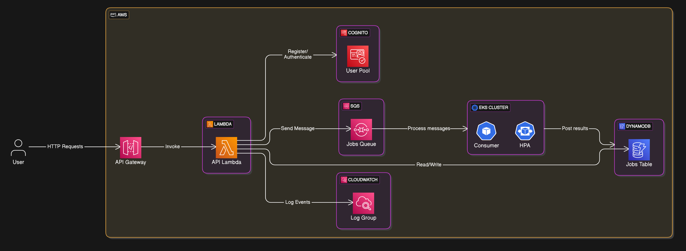

# AWS Maigret



AWS Maigret è un progetto che implementa un servizio di scansione asincrona e scalabile basato sul tool [Maigret](https://github.com/soxoj/maigret), utilizzando esclusivamente lo stack tecnologico AWS. Il servizio è accessibile tramite API, garantendo una gestione efficiente e potenzialmente infinita di job paralleli attraverso un'architettura robusta e cloud-native.

Caratteristiche principali

- API Gateway: Espone un unico endpoint centralizzato per semplificare l'accesso alle API.

- AWS Lambda: Utilizzato insieme ad API Gateway per fornire API serverless rapide ed efficienti.

- Amazon Cognito: Garantisce un sistema di autenticazione e autorizzazione sicuro e affidabile, integrato con le API Lambda.

- Amazon SQS: Gestisce la comunicazione asincrona tra componenti e consente di realizzare un'architettura scalabile basata su code.

- Amazon EKS + KEDA: Permette l'autoscaling dinamico dei worker Kubernetes, in funzione della quantità di messaggi presenti nelle code SQS.

- DynamoDB: Archivia in modo efficiente i risultati delle scansioni effettuate con Maigret, offrendo alte prestazioni e facilità di accesso ai dati.

Questo progetto dimostra l'efficacia di una soluzione completamente cloud-native per eseguire operazioni asincrone intensive in modo altamente scalabile e sicuro.

## Deploy

```
git clone https://github.com/krosspile/aws-maigret.git
cd aws-maigret/terraform
terraform apply -auto-approve
terraform apply -auto-approve -var="deploy_k8s=true" 
```
